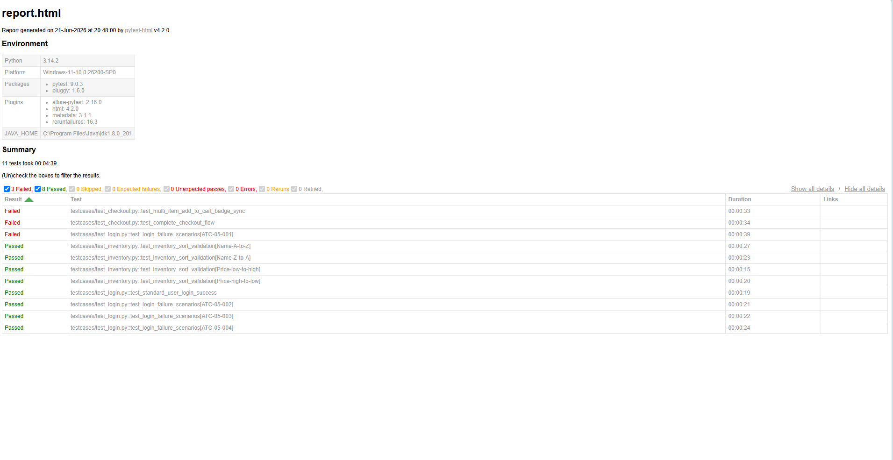
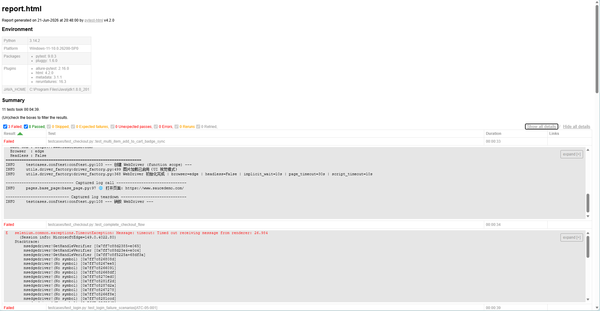
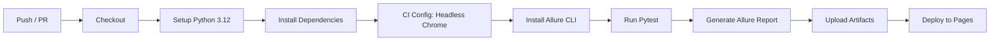

# 🛒 Swag Labs 电商平台 — Selenium 自动化测试框架

> **企业级 UI 自动化测试解决方案** | Python 3.12+ | Selenium 4 | Pytest | Allure | POM

[](https://www.python.org/)
[](https://www.selenium.dev/)
[](https://docs.pytest.org/)
[](https://allurereport.org/)
[](https://github.com/features/actions)

---

## 📖 项目简介

本项目对 [Sauce Demo](https://www.saucedemo.com/) 电商平台进行**黑盒功能自动化测试**，覆盖登录、商品浏览、购物车、结账等核心交易链路。框架采用 **Page Object Model (POM)** 分层架构，支持 Chrome / Edge 双浏览器、Headless 无头模式、Allure 可视化报告、GitHub Actions 持续集成。


---

## 🛠 技术栈

| 分类 | 技术 | 用途 |
|------|------|------|
| 语言 | Python 3.12+ | 主编程语言 |
| 自动化引擎 | Selenium 4.45 | 浏览器驱动 & DOM 操作 |
| 测试框架 | Pytest 9.0 | 用例管理 / Fixture / 参数化 |
| 报告 | Allure 2.33 + pytest-html | 可视化报告 + 趋势图 |
| 设计模式 | Page Object Model (POM) | 页面-操作分层解耦 |
| 配置管理 | YAML | 环境 / 账号 / 超时集中管理 |
| 日志 | logging + TimedRotatingFileHandler | 按天切割双输出日志 |
| CI/CD | GitHub Actions | Push 自动触发 → 产物上传 |
| 缺陷管理 | ZenTao (禅道) REST API | 13 条 Bug 已提交上线 |

---

## 📁 目录架构

```
SwagLabs_电商平台功能测试与自动化测试实战/
├── README.md                       ← 本文件
├── requirements.txt                ← Python 依赖清单
├── CLAUDE.md                       ← 项目记忆文件（自动加载）
├── .github/workflows/main.yml      ← CI/CD 流水线
│
├── automation/                     ← 🔥 自动化框架根目录
│   ├── pytest.ini                  ← Pytest 全局配置
│   ├── config/
│   │   ├── __init__.py
│   │   └── config.yaml             ← 环境/账号/超时/代理 集中配置
│   ├── data/
│   │   ├── __init__.py
│   │   ├── login_data.json         ← ATC-05 异常登录数据集
│   │   └── checkout_data.yaml      ← 结账边界值数据集
│   ├── pages/                      ← POM 页面对象层
│   │   ├── __init__.py
│   │   ├── base_page.py            ← 基类（智能等待/JS降级/截图）
│   │   ├── login_page.py           ← 登录页 (7 定位器)
│   │   ├── inventory_page.py       ← 商品列表页 (16 定位器)
│   │   ├── cart_page.py            ← 购物车页 (8 定位器)
│   │   └── checkout_page.py        ← 结账三步页 (23 定位器)
│   ├── testcases/                  ← 测试用例层
│   │   ├── __init__.py
│   │   ├── conftest.py             ← Fixture/Hook（driver生命周期/失败截图）
│   │   ├── test_login.py           ← ATC-01(登录成功) + ATC-05(异常数据驱动)
│   │   ├── test_inventory.py       ← ATC-02(排序验证)
│   │   └── test_checkout.py        ← ATC-03(加购Badge) + ATC-04(完整结账)
│   ├── utils/                      ← 工具层
│   │   ├── __init__.py
│   │   ├── settings.py             ← 单例配置解析器
│   │   ├── logger_util.py          ← 日志系统（控制台+文件双输出）
│   │   ├── driver_factory.py       ← WebDriver 工厂（Chrome/Edge/Headless/代理）
│   │   └── data_loader.py          ← JSON/YAML 数据加载器
│   ├── logs/                       ← 日志输出（按天切割）
│   └── reports/                    ← 测试报告
│       ├── report.html             ← Pytest HTML 报告
│       ├── allure-results/         ← Allure 原始结果
│       ├── allure-report/          ← Allure 可视化报告
│       └── screenshots/            ← 失败截图
│
├── 测试用例/                        ← Excel 测试资产
│   └── Swag_Labs_测试资产_企业级规范版.xlsx
├── 测试文档/                        ← 项目方案 & 执行日志
├── 架构图与抓包/                    ← Mermaid 流程图 & HAR 日志
└── 自动化脚本/                      ← 禅道 API 提交等辅助脚本
```

---

## ⚡ 一键环境搭建

```bash
# 1. 克隆项目（或解压到本地）
cd SwagLabs_电商平台功能测试与自动化测试实战

# 2. 创建虚拟环境（推荐）
python -m venv venv
source venv/bin/activate      # Linux/Mac
# venv\Scripts\activate       # Windows

# 3. 安装依赖
pip install -r requirements.txt

# 4. 验证环境
cd automation
python -c "from utils.settings import Settings; print(Settings().base_url)"
# 输出: https://www.saucedemo.com/
```

> 💡 **Edge 用户**：EdgeDriver 已预装在 Windows 上，框架默认使用 Edge（国内直连微软服务器，无需翻墙）。
> **Chrome 用户**：修改 `config/config.yaml` → `browser.type: "chrome"`。

---

## 🚀 本地运行

### 基础运行

```bash
cd automation

# 运行全部用例 + 生成 HTML 报告（推荐）
python -m pytest testcases/ -v --tb=line --capture=no --html=reports/report.html --self-contained-html

# 仅运行用例（不生成报告）
python -m pytest testcases/ -v

# 运行冒烟测试（仅核心链路）
python -m pytest testcases/ -v -m smoke

# 运行指定模块
python -m pytest testcases/test_login.py -v
python -m pytest testcases/test_inventory.py -v
python -m pytest testcases/test_checkout.py -v

# 切换浏览器 / Headless 模式
# 修改 config/config.yaml: browser.type / browser.headless
```

### Allure 可视化报告

```bash
cd automation

# 1. 安装 Allure CLI（macOS）
brew install allure
# 或手动下载: https://github.com/allure-framework/allure2/releases

# 2. 运行测试（自动生成 Allure 原始数据）
python -m pytest testcases/ --alluredir=reports/allure-results

# 3. 生成 & 打开报告
allure generate reports/allure-results -o reports/allure-report --clean
allure open reports/allure-report
```

### Pytest HTML 报告

```bash
# 运行全部用例并生成报告（自动修复 file:// 兼容性）
python -m pytest testcases/ -v --tb=line --capture=no --html=reports/report.html --self-contained-html
# 双击 automation/reports/report.html 即可查看
```

> 报告已集成自动修复机制（`conftest.py` → `pytest_unconfigure` hook），
> 修复 `history.pushState` 在 `file://` 协议下的 SecurityError，
> 双击即可正常打开，无需启动 HTTP 服务。

### Allure 可视化报告（备选）

```bash
# 需先安装 Allure CLI: https://github.com/allure-framework/allure2/releases
cd automation
python -m pytest testcases/ --alluredir=reports/allure-results
allure serve reports/allure-results
```

---

## 📸 成果演示

### Pytest HTML 报告总览



### 测试详情展开



---

## 🧪 测试用例清单

| 编号 | 用例名称 | 模块 | 类型 | 标签 |
|------|---------|------|------|------|
| ATC-01 | 标准用户登录成功验证 | 登录 | 正向 | `smoke` `login` |
| ATC-02 | 商品列表多维度排序验证 (az/za/lohi/hilo) | 商品列表 | 回归 | `regression` `inventory` |
| ATC-03 | 多商品加购与购物车Badge数字同步 | 购物车 | 正向 | `smoke` `cart` |
| ATC-04 | 完整结账流程 (Inventory→Cart→Checkout→Complete) | 结账 | 正向 | `smoke` `checkout` |
| ATC-05 | 异常登录数据驱动 (锁定/空用户名/空密码/错密码) | 登录 | 负向 | `data_driven` `login` |

---

## 🔄 CI/CD 流水线

GitHub Actions 在 **Push / Pull Request** 时自动执行：



**产物（保留 30 天）**：
- `allure-report` — Allure 可视化报告
- `pytest-html-report` — HTML 测试报告
- `test-logs` — 执行日志

---

## 📊 框架亮点

| 特性 | 说明 |
|------|------|
| 🔒 **零硬编码** | 所有 URL/账号/超时从 YAML 读取，Settings 单例管理 |
| 🛡️ **JS 点击降级** | ElementClickIntercepted 自动降级为 JS 强制点击 |
| ⏱️ **零 time.sleep()** | 全部基于 WebDriverWait + expected_conditions |
| 🌐 **跨境加载优化** | eager 策略 + DNS 优化 + 图片开关 + 硬性超时兜底 |
| 📸 **失败自动截图** | pytest_runtest_makereport Hook → Allure 附件 + 磁盘保存 |
| 🧹 **Driver 生命周期** | function 级隔离 → try/finally + try/except 双层防御 |
| 🏷️ **定位器工厂方法** | @staticmethod 动态定位器，零内联 (By.XXX, ...) |
| 📦 **数据驱动测试** | JSON/YAML → pytest.mark.parametrize → 4×4 参数覆盖 |

---

## 🔗 相关资源

- **被测系统**：[https://www.saucedemo.com/](https://www.saucedemo.com/)
- **Selenium 4 文档**：[https://www.selenium.dev/documentation/](https://www.selenium.dev/documentation/)
- **Pytest 文档**：[https://docs.pytest.org/](https://docs.pytest.org/)
- **Allure 文档**：[https://allurereport.org/docs/](https://allurereport.org/docs/)
- **ZenTao (禅道)**：[https://zenboard.demo.qucheng.cc](https://zenboard.demo.qucheng.cc)

---

<p align="center">
  <sub>Built with ❤️ for Software Testing Excellence | 2026 Summer Internship Project</sub>
</p>
